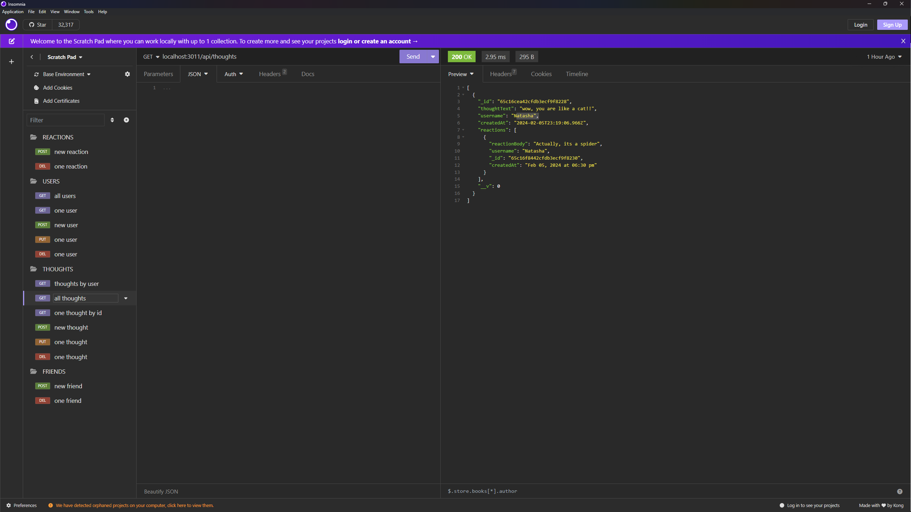
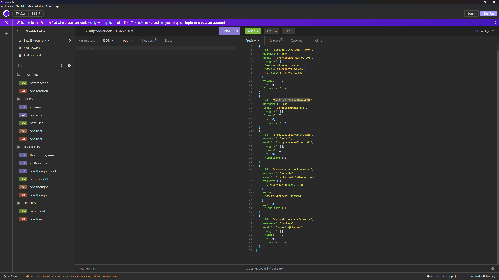
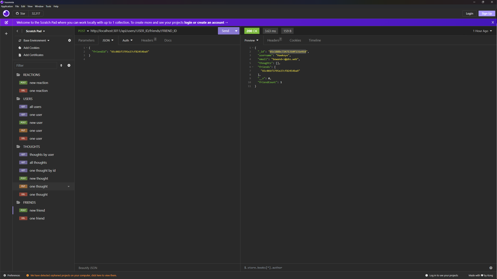
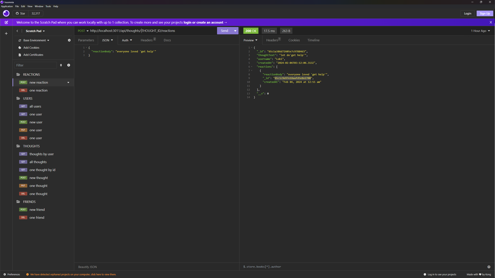

# Social Thoughts API
  
  
  
  ## Description
  
  The Social Thoughts API is a RESTful API that allows users to create, read, update, and delete thoughts and reactions to those thoughts. Users can also add and remove friends from their friend list. The API is built using Express.js, Mongoose, and MongoDB. This application allows for friends to be connected both to their thoughts and to other users, as well as tally reactions to individual thoughts.
  
  
  ## Table of Contents
  
  - [Installation](#installation)
  - [Usage](#usage)
  - [Credits](#credits)
  - [Features](#features)
  - [How To Contribute](#how-to-contribute)
  - [Tests](#tests)
  - [License](#license)
  - [Questions](#questions)
  
  
  ## Installation
  - Clone the <a href="https://github.com/mighty-little-coder/Social_Thoughts_API">repository</a> to your local machine
  - Open the terminal and navigate to the root directory of the project
  - Run `npm install` to install the necessary dependencies
  - Run `npm run dev` to start the server
  - Open Insomnia Core and test the routes
  
  
  ## Usage
  To view the finished product, click this <a href="https://github.com/mighty-little-coder/Social_Thoughts_API">link and copy the repository code to your local machine.</a>
  
  Click this <a href="https://drive.google.com/file/d/1TNXIhS5C5f2pgE4TA_onYUU0VlyQUpHu/view?usp=drive_link">link</a> to view the full walkthrough video!

  Otherwise, here are some screenshots of the application in action:

  
  
  
  
  

  ## Credits
  
  - <a href="https://chat.openai.com/">ChatGPT 3.5</a>
  - <a href="https://github.com/features/copilot?ef_id=_k_CjwKCAiAq4KuBhA6EiwArMAw1FOutqMK0saZxH8FwReh32EgrB9jOkJA2Gi0O3-RqIINbuOsOHKHhxoCfKwQAvD_BwE_k_&OCID=AIDcmmc3fhtaow_SEM__k_CjwKCAiAq4KuBhA6EiwArMAw1FOutqMK0saZxH8FwReh32EgrB9jOkJA2Gi0O3-RqIINbuOsOHKHhxoCfKwQAvD_BwE_k_&gad_source=1&gclid=CjwKCAiAq4KuBhA6EiwArMAw1FOutqMK0saZxH8FwReh32EgrB9jOkJA2Gi0O3-RqIINbuOsOHKHhxoCfKwQAvD_BwE">Github CoPilot</a>
  - <a href="https://developer.mozilla.org/en-US/">MDN</a>
  - <a href="https://leewarrick.com/">Lee Warrick</a> UCONN Bootcamp Instructor
  - <a href="https://github.com/miacias">Mia Ciasullo</a> UCONN Bootcamp Instructor
  - <a href="https://github.com/samanthashleyrose">Samantha Rose</a> UCONN Bootcamp Student
  - <a href="https://github.com/siennameow">Sienna Li</a>
  - <a href="https://youtu.be/Ull3rMOP3s8?si=_EN9gIqz5sWd64pR">Steph F</a> for a demonstration of walk-through video
  
  ## Technologies Used

  - JavaScript
  - Node.js
  - Express.js
  - MongoDB
  - Mongoose
  - Insomnia Core
  - Git
  - GitHub
  - Moment.js

  ## Features
  
  This API allows users to:
  - Create, read, update, and delete thoughts
  - Create, read, update, and delete reactions to thoughts
  - Add and remove friends from their friend list
  - View all thoughts and users
  
  
  ## How to Contribute
  
  If you would like to contribute to this project, please contact me via email or GitHub. My contact information is listed in the Questions section below.
   
  Consider also opening an issue to discuss the changes you would like to make. Additionally, you may fork the repository, make the changes, and submit a pull request for review.
  
  ## Tests
  
For this project, all tests will be run in an API development environment such as Insomnia Core. The tests can include:
- GET all thoughts
- GET all users
- POST new thoughts
- POST new reactions
- POST new friends
- POST new users
- PUT update users
- PUT update thoughts
- PUT update reactions
- PUT update friends
- DELETE users
- DELETE thoughts
- DELETE reactions
- DELETE friends
  
  
  ## License
  
  This project is licensed under the MIT LICENSE - see the <a href="https://opensource.org/licenses/MIT">MIT LICENSE</a> file on OpenSourceInitiative.org for details.
  
  
  ## Questions
  
  For further questions, please connect with me at <a href="https://github.com/mighty-little-coder">mighty-little-coder</a>, 
  or contact me via email at <a href="email@email.email">email@email.email</a>.